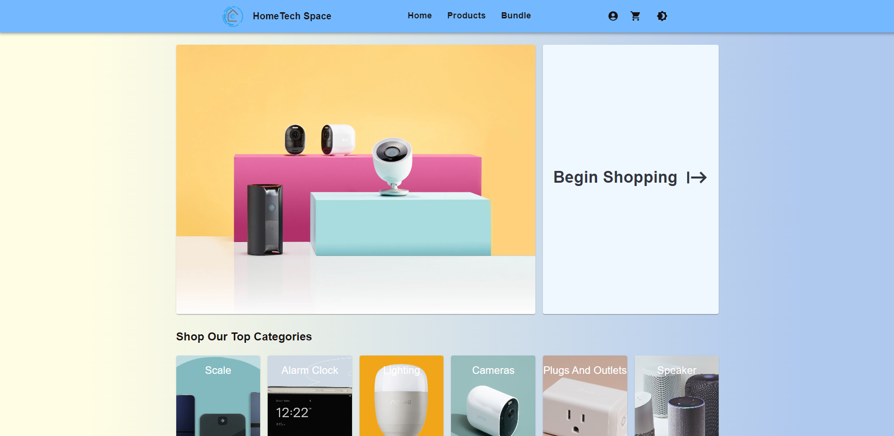

# Hi there, I'm Huy Huynh - a passionate Full Stack Developer 👋

## ✨ About Me

- I am a full stack developer who recently embarked on the web development journey and strives to improve myself by participating and collaborating in amazing projects.
- 🔭 I am skilled in HTML, CSS, and Javascript.
- 🌱 I’m currently learning Typescript.
- 👯 I’m looking to collaborate with other content creators
- 🥅 2023 Goals: Learn more framework and build more project.
- ⚡ Fun fact: I love to play sports and listen to music.

### Connect with me:

### Checkout my recent project:

#### HomeTech-Space

- Project Description: Developed a full-stack smart home electronic ecommerce platform that provides a seamless shopping experience for online shoppers.
- Core Features: Product description, product filters, distinct category section with relevant product, shopping cart for item storage, real time dashboards, manage products, manage orders,google sign in, user profile update, responsive.
- Technique: ReactJS, Material UI, NodeJS, MongoDB, ExpressJS, Redux Toolkit, Axios, React Hook Form, Mongoose, Express Validator, Passport.

#### Check out the Source Code here!

- [Front End](https://github.com/huyh1010/HomeTech-Space-FE)
- [Back End](https://github.com/huyh1010/HomeTech-Space)

### Languages and Tools:

             

 
 

---

### 📖 Other Projects

#### [CONnect Social Media App](https://connect-huyhuynh1010.netlify.app)

- [Project source](https://github.com/huyh1010/HomeTech-Space-FE)
- Project Description : Developed a front-end social network website that allows individuals to share information, interact, and make connections with other users.
- Core Features: user sign in, user registration, create and manage social post, create comment, send friend request, updating friend request, user - profile modification, responsive.
  Technique: ReactJS, Material UI, Redux Toolkit, Axios, React Hook Form, React Router.

#### [Vime Movie App](https://vime.netlify.app)

- [Project source](https://github.com/huyh1010/Vime)
- Project Description: Developed a front-end movie app that displays movie and tv shows information worldwide.
- Core Features: movies and tv shows description, genre filtering options, name search filter, add to favorite list, responsive, route navigation.
- Technique: HTML, CSS, ReactJS, React Router, Material UI, Axios, TMDb API.
